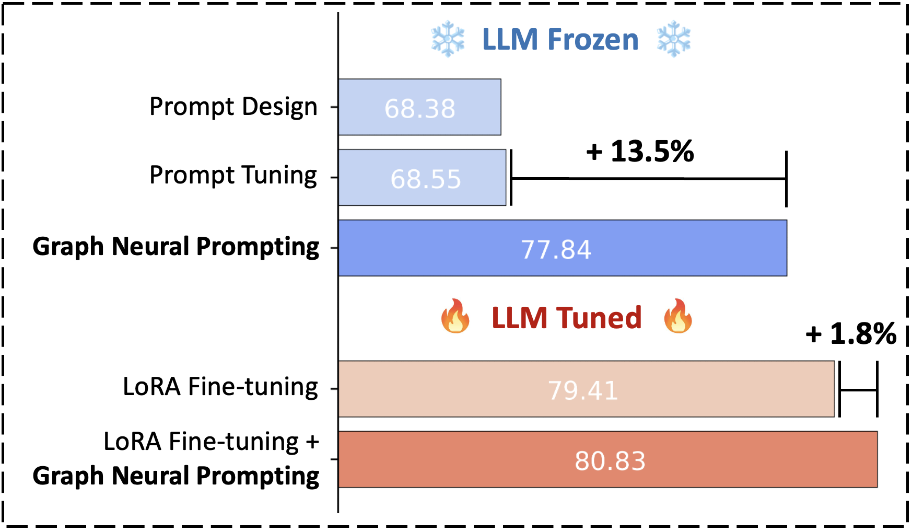
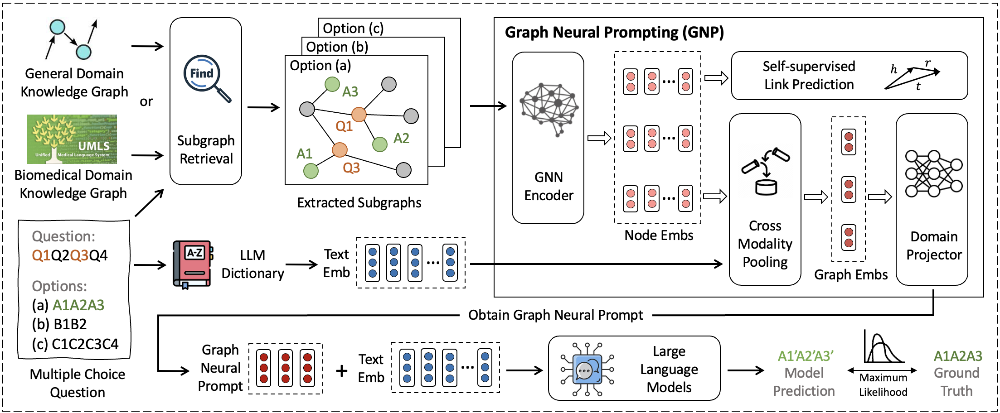

# Graph Neural Prompting with Large Language Models

This repo provides the source code & data for AAAI 2024 paper "Graph Neural Prompting with Large Language Models".

Paper: https://arxiv.org/pdf/2309.15427

<p align="center">
  
</p>


### Overview
Large language models (LLMs) have shown remarkable generalization capability with exceptional performance in various language modeling tasks. However, they still exhibit inherent limitations in precisely capturing and returning grounded knowledge. While existing work has explored utilizing knowledge graphs (KGs) to enhance language modeling via joint training and customized model architectures, applying this to LLMs is problematic owing to their large number of parameters and high computational cost. Therefore, how to enhance pre-trained LLMs using grounded knowledge, e.g., retrieval-augmented generation, remains an open question. In this work, we propose **Graph Neural Prompting (GNP), a novel plug-and-play method to assist pre-trained LLMs in learning beneficial knowledge from KGs.** GNP encompasses various designs, including a standard graph neural network encoder, a cross-modality pooling module, a domain projector, and a self-supervised link prediction objective. Extensive experiments on multiple datasets demonstrate the superiority of GNP on both commonsense and biomedical reasoning tasks across different LLM sizes and settings.


<p align="center">
  
</p>


## 0. Dependencies

Run the following commands to create a conda environment:
```
conda create --name torch python=3.10
conda activate torch
pip install -r requirements.txt
```

## 1. Download Data

**Notes by 09/23/2024: Yijun does not have the access to the data. Please follow the optional steps below to download/preprocess the data.**

If running the code in the local, please download the data from Amazon S3: https://s3.console.aws.amazon.com/s3/buckets/yijunt-llm-datasets-central-1?region=ca-central-1&tab=objects

If submitting the training job to sagemaker, the code will automatically download the data from S3.

#### (Optional) Download Original Processed Data (only a few datasets)
You can download the original data from [**[here]**](https://nlp.stanford.edu/projects/myasu/DRAGON/data_preprocessed.zip). This includes the knowledge graphs (ConceptNet, UMLS) and 3 datasets (OpenBookQA,  RiddleSense). Specifically, run:
```
wget https://nlp.stanford.edu/projects/myasu/DRAGON/data_preprocessed.zip
unzip data_preprocessed.zip
mv data_preprocessed data
```

#### (Optional) Download/Preprocess Original Unprocessed Data
If you would like to preprocess the raw data from scratch, please refer to the python scripts in the folder ```data_preprocess```:
```
CUDA_VISIBLE_DEVICES=0 python arc_preprocess.py -p <num_processes>
```
The script will:
* Setup ConceptNet (e.g., extract English relations from ConceptNet, merge the original 42 relation types into 17 types)
* Convert the QA datasets into .jsonl files (e.g., stored in `data/csqa/statement/`)
* Identify all mentioned concepts in the questions and answers
* Extract subgraphs for each q-a pair


## 2. Run Graph Neural Prompting (GNP)
To run GNP on various datasets, simply refer to the training scripts in the folder ```scripts/```
```
sh scripts/llm_obqa.sh
sh scripts/llm_arc.sh
sh scripts/llm_piqa.sh
sh scripts/llm_riddle.sh
sh scripts/llm_pubmedqa.sh
sh scripts/llm_bioasq.sh
```
hyper-parameters and utilized model components can be adjusted within each training script.

Scripts for baselines, ablation studies, and model design comparisons are also provided.

## 3. Reference

```
@inproceedings{tian2024graph,
  title={Graph neural prompting with large language models},
  author={Tian, Yijun and Song, Huan and Wang, Zichen and Wang, Haozhu and Hu, Ziqing and Wang, Fang and Chawla, Nitesh V and Xu, Panpan},
  booktitle={Proceedings of the AAAI Conference on Artificial Intelligence},
  volume={38},
  number={17},
  pages={19080--19088},
  year={2024}
}
```